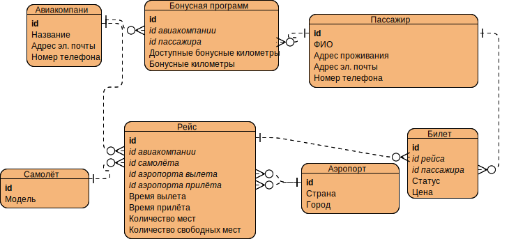
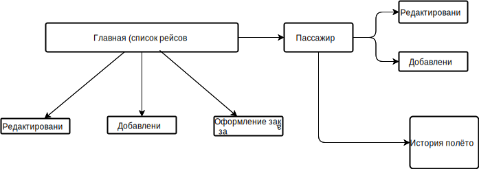

# Система управления информацией о рейсах, наличии билетов и ценах на них, а также продажи билетов
## Схема базы данных

## Описание страниц

При помощи меню с каждой страницы можно перейти на:
- Главная со списком рейсов
- История полётов
- Список пассажиров

### Главная
- список рейсов
- есть кнопки "Удалить" и "Редактировать" для каждого рейса
- кнопки "Добавить рейс" и "Оформление билета" ведут на соответсвующие страницы

### Добавление рейса
- информация о рейсе
- кнопка "Добавить"

### Редактирование рейса
- информация о рейсе
- кнопка "Сохранить"

### Оформление билета
- информация для создания билета

### Пассажиры
- список
- есть кнопки "Удалить" и "Редактировать" для каждого
- кнопка "Добавить пассажира" для перехода на соответсвующую страницу.

### Редактирование пассажира
- новая информация
- Кнопка "Сохранить"

### Добавление пассажира
- новая информация
- Кнопка "Добавить"

### История полётов
- по заданному id при нажатии на кнопку "Показать" появится список рейсов

## Некоторые сценарии использования
- Для получения списка авиарейсов нужно
  - Перейти на главную страницу

- Для получения списка пассажиров нужно
  - Перейти на страницу "Пассажиры"

- Для получения истории заказов пассажира нужно
  - Перейти на страницу "История полетов"
  - Ввести id пассажира и нажать кнопку "Получить историю полетов"

- Для заказа и оплаты билетов на выбранный рейс нужно
  - Перейти на главную страницу
  - нажать кнопку "Оформление билета"
  - Ввести данные
  - Нажать кнопку "Оформить"

- Для добавления или удаления рейса, чтения или редактирования данных о нём, нужно
  - Перейти на главную страницу
  - Нажать кнопку "Редактировать" или "Добавить рейс" или "Удалить"
  - Ввести информацию и нажать соответсвующую кнопку

- Для добавления или удаления пассажира, чтение и редактирование данных о нём, нужно
  - Перейти на страницу "Пассажиры"
  - Нажать кнопку "Редактировать" или "Добавить пассажира" или "Удалить"
  - Ввести информацию и нажать соответсвующую кнопку
